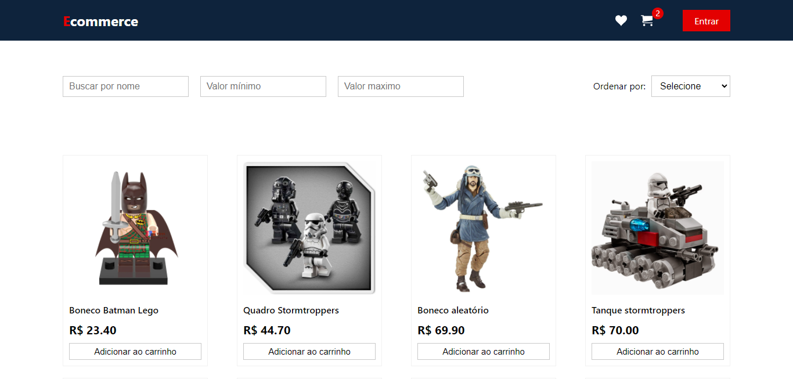
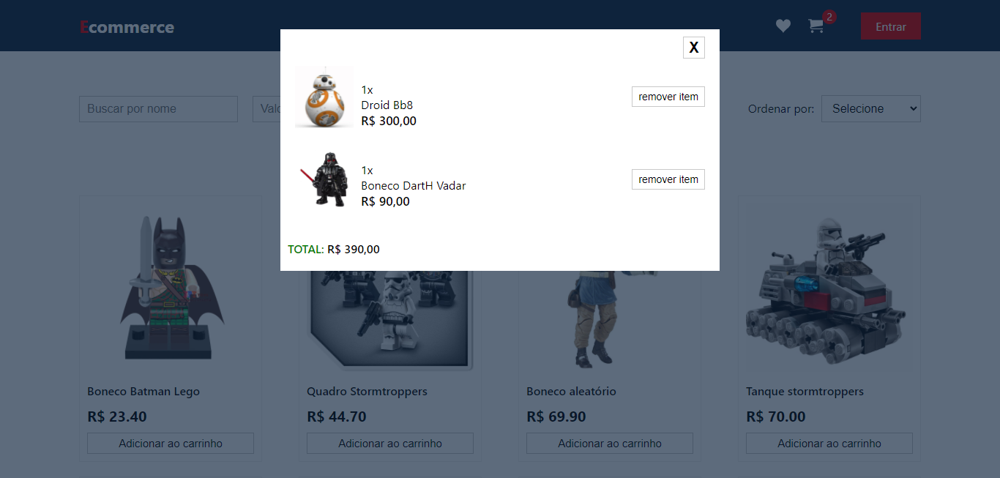

<h1 align="center">
     Projeto LabECommerce
</h1>

---
##  🕵Sobre

 O LabEcommerce é um projeto de criação de um ecommerce utilizando o React.

##  👩🏾Quem Faz 

 - Flávio José Fonseca Filho
 - Laís de Medeiros Silva
 - Luiz Gustavo Santos
 
---

##  🧭Status do Projeto

 - ⌛ Feito

---

##  🎯Objetivo do Projeto

Este é um projeto de Front-end , desenvolvido no bootcamp da Labenu, cujo a proposta era criar um site de e-Commerce utilizando o React.js para praticar habilidades e recursos como:

- Componentização
- Styled-Components
- Manipulação de Estado
- Ciclos de vida
- Renderização Condicional
- LocalStorage

## ☑️Requisitos de Funcionalidade

- [v] Adiconar produtos no carrinho
- [v] Remover produtos do carrinho
- [v] Salvar produtos do carrinho no localStorage do navegador
- [v] Filtragem de produtos por nome, valor mínimo e valor máximo
- [v] Ordenação por order crescente e decrescente
- [v] Responsividade

---

## 🔗Link para Acessar

- [LabEcommerce](https://absurd-wash.surge.sh/)

---
